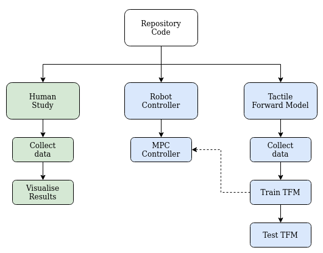
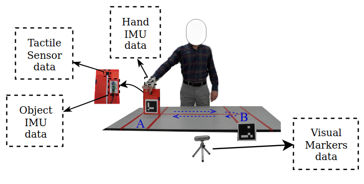
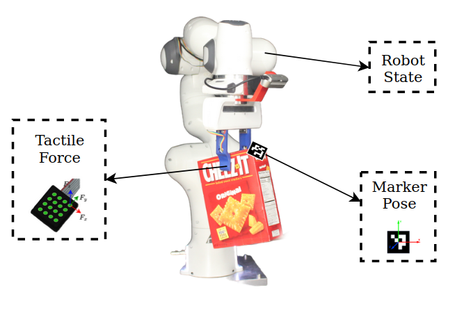

**Beyond Grip Force: Investigating Trajectory Modulation for Slip Control in Human and Robot Manipulation Tasks**
============

This repository provides code for experimentation and analysis of the paper titled "Beyond ..."

We provde implementation of the following subset of methods described in the paper:

- Human physiology study on slip control
- Robotic experiments on slip control using trajectory modulation
- Tactile forward model offline training

  
  
Figure1. Repository content.

Figure1. shows the structure of the code content in the repository. The content for human and robotic experiments are shown with green and blue colors respectively.

**Human Study**

The /human_study folder includes the code for performing the experimentation with human participants. The main components of the code are:

- Data collectoin Script
- Visualise trial results
- Analyse subject scores

Detailed instruction for running the code of each part is provided in the [readme of the human study folder](/human_study/README.md).

The data collection script records participants' data consisting of hand acceleration and rotation, object acceleration and rotation, tactile sensor normal and shear force data, and visual markers' pose. Figure2 shows the structure of collected data in human participants study.

  
  
Figure2. Human study recorded data.

Using the visual markers' data, participants' task compeltion time is calculated offline.

The raw data of the human participants study presented in the paper can be downloaded with this link.

**Robotic Experiments**

The /robot_experiments directory includes the code for regenerating the implementation of the slip controller introduced in the paper. This ros package depends on *libfranka* library which is the low-level control software of franka Emika robotic arm.

The low-level controller (C++) scripts recieves the commanded Cartesian trajectories from the MPC controller script through a ros message. Detailed descripton of how to use the codes is provided in the [readme of the robot experiments](/robot_experiments/README.md) folder.

**Tactile Forward Model**

The /tactile_forward_model directory includes the code for trainig the forward model including Action Conditioned Tactile Prediction and Slip Classification Models. The [readme file in /tactile_forward_model](/tactile_forward_model/README.md) directory includes detailed instruction for running the code.

Recorded data for traing the forward model is illustrated in Figure3.

  
  
Figure3. Robotic experiments recorded data.

